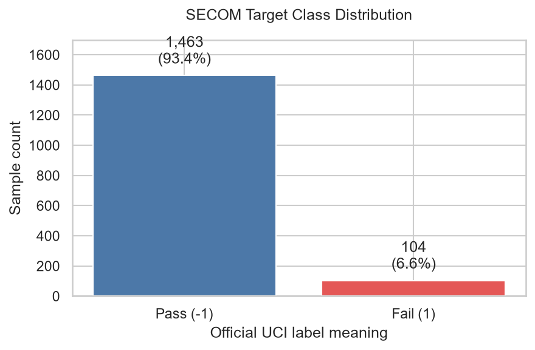
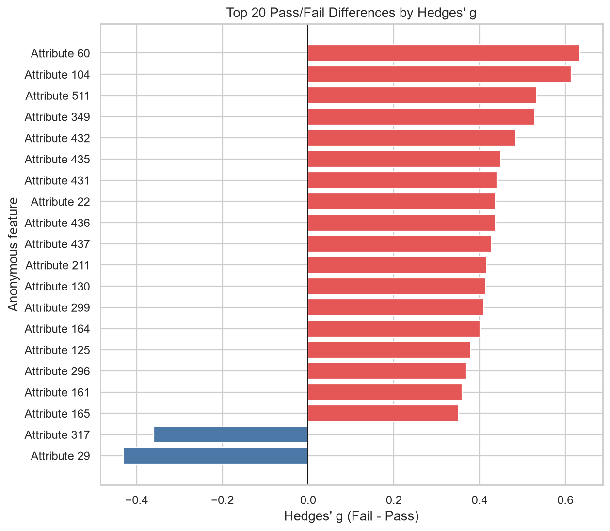
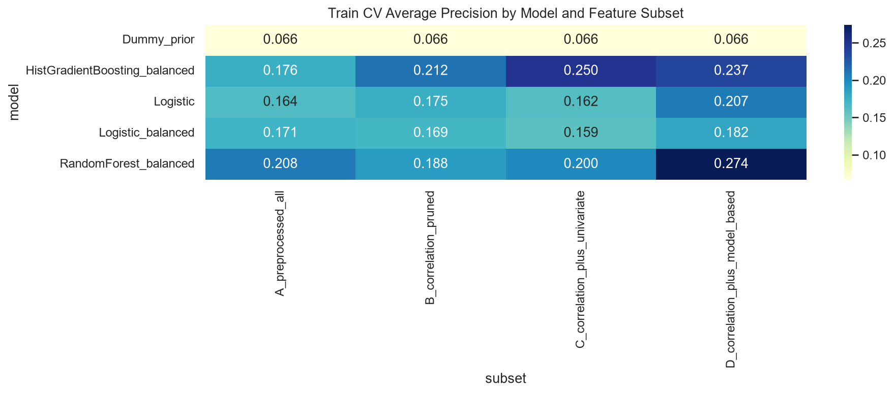
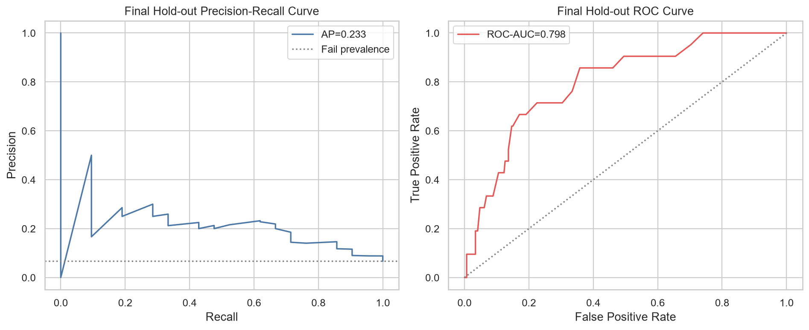
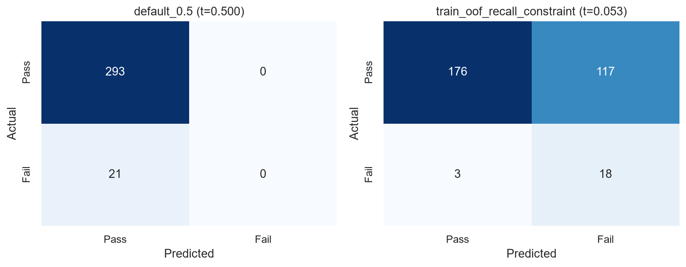
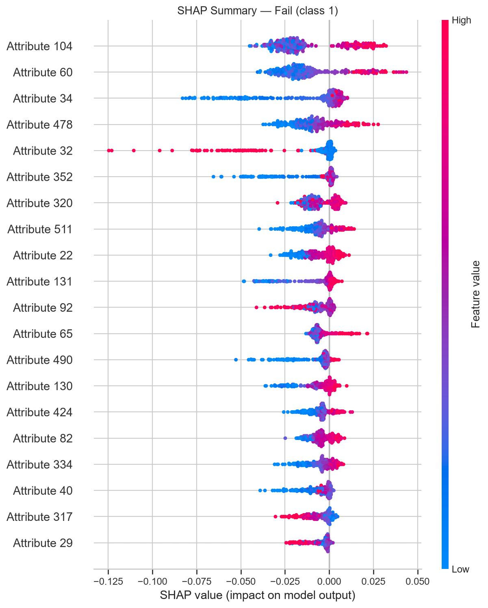

# Semiconductor SECOM Yield Analysis

## 1. Project Overview

UCI SECOM 데이터로 반도체 제조 공정의 Pass/Fail 패턴을 살펴보고 불량 샘플을 분류했습니다. 여러 분석 단계에서 반복해서 중요하게 나타난 Feature도 함께 확인했습니다.

공정 측정값은 `Attribute 1`부터 `Attribute 590`까지 익명화되어 있습니다. 예측 관계는 분석할 수 있지만 개별 Feature를 온도, 압력, 장비 상태와 같은 실제 공정 변수로 해석할 수는 없습니다.

## 2. Dataset

| 항목 | 내용 |
|---|---:|
| Samples | 1,567 |
| Numeric process attributes | 590 |
| Additional field | `timestamp` |
| Target | `class` |
| Pass (`-1`) | 1,463 |
| Fail (`1`) | 104 |
| Fail rate | 6.64% |

데이터는 `ucimlrepo.fetch_ucirepo(id=179)`로 불러옵니다. 원본 및 전처리 데이터 파일은 저장소에서 추적하지 않습니다.

- Dataset: [UCI Machine Learning Repository — SECOM](https://archive.ics.uci.edu/dataset/179/secom)
- DOI: [10.24432/C54305](https://doi.org/10.24432/C54305)
- Original authors: Michael McCann and Adrian Johnston
- License: [Creative Commons Attribution 4.0 International (CC BY 4.0)](https://creativecommons.org/licenses/by/4.0/)

> McCann, M., & Johnston, A. (2008). *SECOM* [Dataset]. UCI Machine Learning Repository. https://doi.org/10.24432/C54305

## 3. Problem

- Fail은 전체의 6.64%로 심한 클래스 불균형이 존재합니다.
- 전체 Feature 값 중 4.53%가 결측치입니다.
- Constant, duplicate, 높은 결측률, 강한 상관관계를 가진 Feature가 존재합니다.
- Feature가 익명화되어 있어 통계적·예측적 관계를 실제 공정 의미와 연결하기 어렵습니다.



## 4. Analysis Pipeline

| Notebook | 단계 | 수행 내용 |
|---|---|---|
| `01_data_understanding.ipynb` | Data Understanding | 공식 metadata, 변수 구조, Target 분포, 결측치, constant·duplicate Feature와 기술통계를 확인합니다. |
| `02_preprocessing.ipynb` | Preprocessing | Timestamp를 별도로 보존하고 constant·duplicate·고결측 Feature를 제거한 뒤 EDA용 median-imputed 데이터를 생성합니다. |
| `03_eda.ipynb` | EDA | Pass/Fail 통계, Hedges' g, Welch 검정과 FDR 보정, 상관관계 및 시간 패턴을 탐색합니다. |
| `04_feature_selection.ipynb` | Feature Selection | Train-only 전처리 후 correlation pruning, Mutual Information, balanced RandomForest importance로 후보 subset을 만듭니다. |
| `05_modeling.ipynb` | Modeling | Feature subset과 기본 모델을 stratified CV로 비교하고 train OOF 예측으로 threshold를 결정한 뒤 hold-out Test를 평가합니다. |
| `06_explainability.ipynb` | Explainability | RF impurity, permutation importance, Fail-class SHAP, TP/FP/FN 사례와 보조 모델의 차이를 분석합니다. |

## 5. Key Data Findings

- 전체 결측률: **4.53%**
- Constant Feature: **116개**
- 전처리 후 cleaned numeric Feature: **442개**
- Benjamini–Hochberg FDR 0.05 기준 Pass/Fail 차이가 유의한 Feature: **21개**
- EDA에서 `|r| ≥ 0.95`인 pair는 271개였고, 가장 강한 Attribute 343–348 pair의 Pearson correlation은 1.0이었습니다.
- Hedges' g가 큰 Feature에는 Attribute 60, 104, 511, 349, 432가 포함됐습니다.



이 결과는 익명 Feature의 Pass/Fail 분포 차이를 나타낼 뿐, 실제 공정 원인이나 인과관계를 의미하지 않습니다.

## 6. Feature Selection

외부 hold-out Test 정보가 selection에 쓰이지 않도록 split 이후 Train 데이터에서만 constant 제거, 40% 초과 결측률 제거, median imputation과 Feature Selection을 수행했습니다.

```text
442 preprocessed features
 └─ 270 after |Pearson r| >= 0.95 correlation pruning
     ├─ Subset C: 69 features (Mutual Information)
     └─ Subset D: 91 features (balanced RandomForest importance)
```

Modeling CV에서 Subset D는 전체 442개 또는 correlation-pruned 270개보다 높은 PR-AUC를 기록했습니다. 이에 Subset D를 최종 RandomForest 후보에 사용했습니다. 다만 Subset C/D selection이 각 CV fold 안에서 완전히 중첩되지는 않았습니다.

## 7. Modeling

Primary metric은 희소한 Fail 클래스의 precision-recall trade-off를 반영하는 Average Precision(PR-AUC)으로 정했습니다. Accuracy 단독으로 모델을 선택하지 않았습니다.

| 항목 | 결과 |
|---|---:|
| Model | Balanced RandomForest |
| Feature subset | Subset D |
| Features | 91 |
| CV PR-AUC | **0.2743 ± 0.0312** |
| Test PR-AUC | **0.2335** |
| Test ROC-AUC | **0.7984** |
| Decision threshold | **0.0533** |
| Fail precision | **0.1333** |
| Fail recall | **0.8571** |
| Fail F1 | **0.2308** |
| Balanced accuracy | **0.7289** |



Feature selection이 전체 outer-train에서 수행된 뒤 CV가 적용되었으므로, 해당 결과는 historical baseline이며 완전한 fold-safe 추정치가 아닙니다.



선택 threshold의 confusion matrix는 **TN 176 / FP 117 / FN 3 / TP 18**입니다.



## 8. Threshold Trade-off

기본 threshold 0.5에서는 Test의 Fail 21개를 하나도 탐지하지 못했습니다. Threshold는 Test 결과가 아니라 Train의 5-fold out-of-fold probability에서 **Fail recall ≥ 0.80을 만족하는 값 중 precision이 가장 높은 값**으로 고정했습니다.

선택값 0.0533에서는 Test Fail 21개 중 18개를 탐지해 recall 0.8571을 얻었지만, 정상 샘플 117개가 False Positive가 되었습니다. 불량 누락을 줄인 대신 추가 검사·재검 비용이 크게 늘어나는 운영상 trade-off입니다.

## 9. Explainability

Attribute 60, 104, 511, 432, 22, 29는 EDA, Feature Selection, 최종 importance 분석 중 여러 단계에서 반복적으로 나타났습니다.

- RF impurity importance의 상위 Feature는 Attribute 104, 60, 34, 478, 32였습니다.
- Test permutation importance의 상위 Feature는 Attribute 60, 478, 432, 66, 461이었습니다.
- Fail-class mean absolute SHAP의 상위 Feature는 Attribute 104, 60, 34, 478, 32였습니다.
- 세 importance 방법의 Top 20에 모두 포함된 Feature는 Attribute 22, 334, 478, 60, 92였습니다.

방법별 순위를 비교할 때는 상관된 Feature가 중요도를 나눠 갖는 현상과 impurity 방식의 편향, 작은 Test Fail 표본에 따른 permutation 변동을 함께 고려해야 합니다.



FP와 TP는 예측 확률 및 주요 Feature 공간에서 크게 겹쳤습니다. FN은 3개뿐이며 확률은 0.0267, 0.0300, 0.0467이었습니다. 이 세 사례만으로 일반적인 불량 누락 원인을 추론하지 않습니다.

## 10. Interpretation

### 관찰된 사실

- 낮은 threshold는 Fail recall을 높이고 False Negative를 21개에서 3개로 줄였습니다.
- 동시에 False Positive가 117개 발생해 Fail precision은 0.1333이었습니다.
- 일부 FP의 Fail probability는 TP보다 높았고 두 그룹의 Feature 분포가 중첩됐습니다.
- 서로 다른 importance 방법과 보조 HistGradientBoosting 모델은 일부 공통 Feature를 찾았지만 세부 순위는 달랐습니다.

### 한계

- 현재 모델 score만으로 Pass와 Fail을 완전히 분리하기 어렵습니다.
- 익명 Feature를 실제 압력, 온도, 공정 조건 또는 장비 상태로 해석할 수 없습니다.
- Predictive association과 SHAP contribution은 causal relation을 의미하지 않습니다.
- Test의 Fail이 21개, FN이 3개뿐이므로 오류 유형 및 permutation importance의 불확실성이 큽니다.
- 현재 결과는 단일 hold-out split에서 얻었으며 외부 제조 환경에 대한 일반화 성능을 입증하지 않습니다.

## 11. Repository Structure

```text
semiconductor-secom-yield-analysis/
├── README.md
├── requirements.txt
├── .gitignore
├── data/
│   ├── raw/                 # ignored except .gitkeep
│   └── processed/           # ignored except .gitkeep
├── docs/
│   └── figures/             # selected public README figures
├── notebooks/
│   ├── 01_data_understanding.ipynb
│   ├── 02_preprocessing.ipynb
│   ├── 03_eda.ipynb
│   ├── 04_feature_selection.ipynb
│   ├── 05_modeling.ipynb
│   └── 06_explainability.ipynb
├── src/
│   └── load_data.py
└── reports/                 # generated reports and figures; ignored
    └── figures/
```

Local `.venv/`와 `.cache/`도 Git에서 제외됩니다.

## 12. Reproduction

Python 3.13 환경에서 실행했습니다.

```powershell
py -3.13 -m venv .venv
.\.venv\Scripts\Activate.ps1
python -m pip install -r requirements.txt
jupyter lab
```

Windows Python Launcher가 해당 버전을 찾지 못하면 설치된 Python 3.13 인터프리터의 전체 경로로 `-m venv .venv`를 실행할 수 있습니다. 가상환경 활성화 후에는 `.venv`의 `python`을 사용합니다.

Notebook은 `01_data_understanding.ipynb`부터 `06_explainability.ipynb`까지 번호 순서로 실행합니다. 데이터는 `ucimlrepo`를 통해 내려받으므로 최초 실행 시 네트워크 연결이 필요합니다.

데이터 품질 검증 모듈의 단위 테스트는 프로젝트 루트에서 다음과 같이 실행합니다.

```powershell
python -m pytest tests/test_data_quality.py
```

### Data quality report

UCI SECOM 데이터는 다음 명령으로 JSON 및 standalone HTML 품질 리포트를 생성합니다.

```powershell
python scripts/generate_quality_report.py --uci-secom
```

일반 CSV는 general preset이 기본이며, 다음과 같이 명시해서 실행할 수도 있습니다. SECOM 형식의 CSV에는 `--preset secom`을 사용합니다.

```powershell
python scripts/generate_quality_report.py --input-csv PATH --preset general
```

기본 출력 위치는 Git에서 제외된 `reports/data_quality/`입니다. `error`가 없으면 `report.passed`는 `True`이며, `warning`과 `not_evaluated`는 결과에 표시되지만 단독으로 실패를 의미하지 않습니다. 오류가 있는 리포트에 non-zero 종료 코드가 필요하면 `--fail-on-error`를 사용합니다.

### Fold-safe modeling evaluation

기존 historical baseline은 outer-train 전체에서 feature selection을 먼저 수행한 뒤 CV를 적용했으므로 validation fold 정보가 선택 과정에 간접적으로 반영될 수 있습니다. Fold-safe 평가는 결측률·constant 제거, median imputation, correlation pruning, MI/RF selection을 각 CV training fold에서만 학습하고 해당 validation fold에는 transform만 적용합니다.

```powershell
python scripts/run_fold_safe_modeling.py --uci-secom
python scripts/run_fold_safe_modeling.py --input-csv PATH --target-column class
```

식별자나 파생 결과 컬럼은 `--exclude-column COLUMN`을 반복해 명시적으로 제외할 수 있습니다. 기본 결과는 Git에서 제외된 `reports/fold_safe_modeling/fold_safe_results.json`과 `fold_safe_fold_metrics.csv`에 저장되며, 같은 출력 경로의 파일은 새 실행 결과로 덮어씁니다. 제조 불량 class `1`이 희소하므로 PR-AUC를 주 지표로 사용하며, 기존 20% historical hold-out은 평가하거나 변경하지 않습니다. 이번 결과는 단일 5-fold Stratified CV이며 repeated CV, threshold tuning, 비용 함수, temporal validation은 후속 단계 범위입니다.

### Repeated CV stability analysis

Validation 3.1 결과에서 dummy 기준선, 최고 non-dummy 조합, 다른 classifier의 최고 조합, feature-selection 비교 조합을 결정적 규칙으로 최대 4개 선정합니다. 기본 평가는 기존 outer hold-out을 건드리지 않고 outer-train에서 5-fold × 5 repeats를 수행하며, 모든 후보가 동일한 split을 공유해 PR-AUC를 paired comparison합니다.

```powershell
python scripts/run_repeated_cv.py --from-validation-results reports/fold_safe_modeling/fold_safe_results.json --candidate all_features:dummy_prior
python scripts/run_repeated_cv.py --from-validation-results reports/fold_safe_modeling/fold_safe_results.json --candidate all_features:dummy_prior --resume
python scripts/run_repeated_cv.py --from-validation-results reports/fold_safe_modeling/fold_safe_results.json --all-candidates
python scripts/run_repeated_cv.py --from-validation-results reports/fold_safe_modeling/fold_safe_results.json --finalize
```

조합별 결과는 `reports/repeated_cv/parts/`에 원자적으로 저장되며, 설정과 dataset·split fingerprint가 같은 완전한 JSON/CSV만 `--resume`으로 재사용합니다. 최종화하면 split 지표, repeat 요약, paired delta, 순위 안정성 JSON/CSV가 `reports/repeated_cv/`에 생성됩니다. 이 디렉터리는 Git에서 제외됩니다.

반복 fold의 training data는 서로 겹치므로 25개 결과를 독립 표본처럼 해석하거나 p-value로 과장하지 않습니다. 후보도 Validation 3.1에서 정한 exploratory shortlist이며 외부 검증을 거친 최종 선택이 아닙니다. threshold 최적화와 시간 순서 기반 검증은 아직 적용하지 않았습니다.

## 13. Tech Stack

- Python 3.13
- pandas, NumPy
- scikit-learn
- Matplotlib, seaborn
- SHAP
- JupyterLab
- ucimlrepo

## 14. Future Work

- Repeated stratified CV로 성능 추정의 변동성 확인
- False Negative와 False Positive 비용을 반영한 cost-sensitive threshold 최적화
- Resampling을 fold 내부에 제한한 imbalance 처리 방법 비교
- XGBoost 또는 LightGBM 등 외부 boosting 모델의 통제된 비교
- Timestamp 순서를 고려한 temporal validation
- Lot, wafer, 장비 및 공정 단계 metadata가 제공될 경우 그룹·시간 기반 검증
- 독립적인 제조 데이터에서 외부 검증
